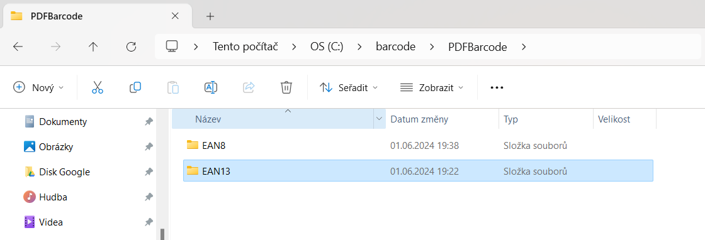
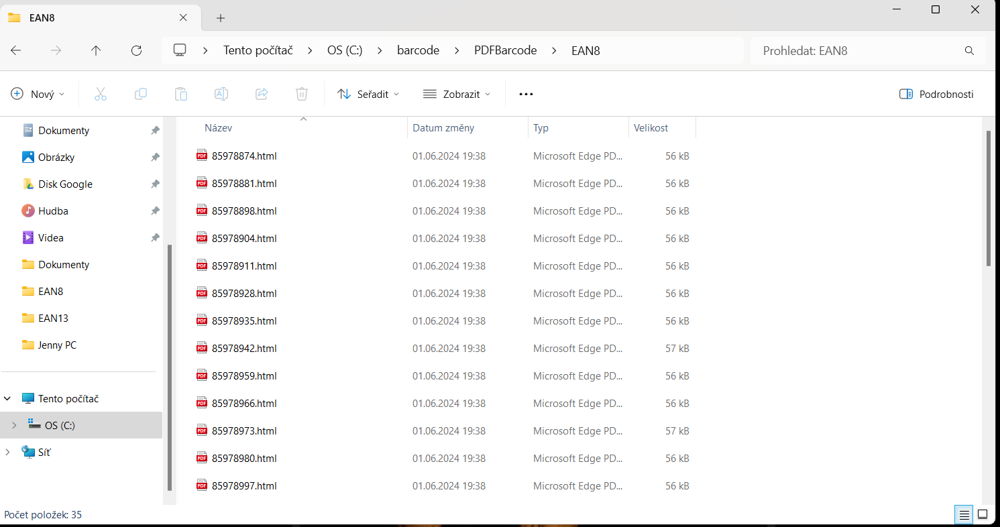
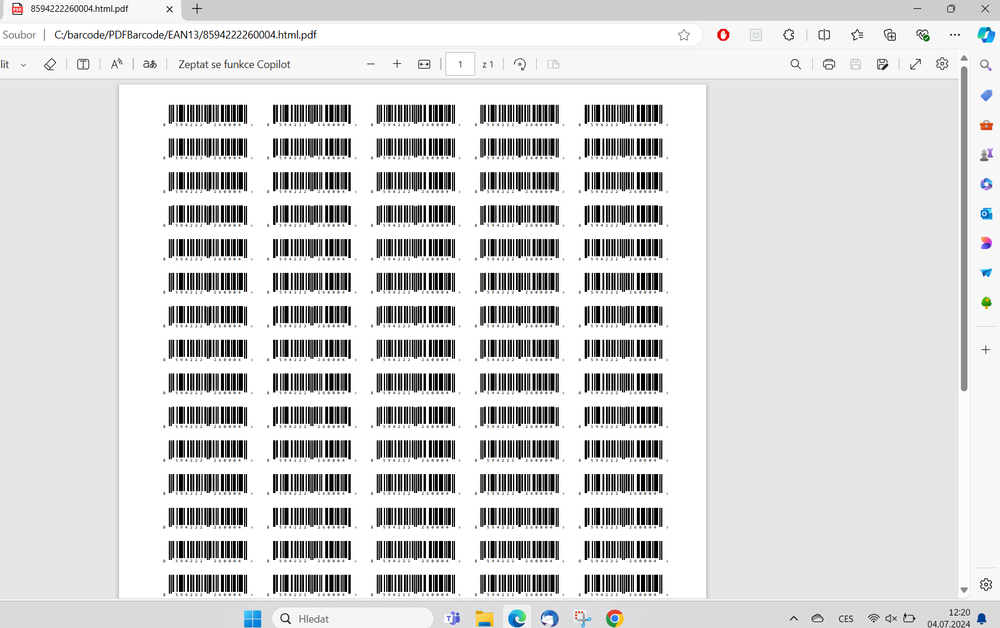
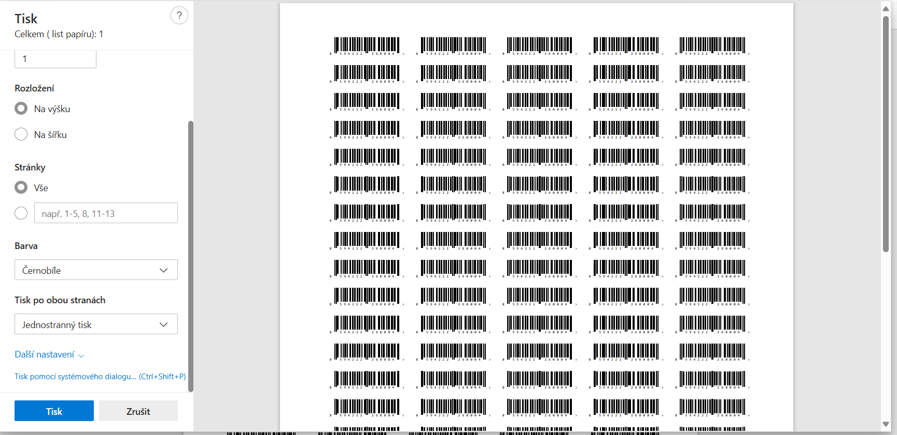
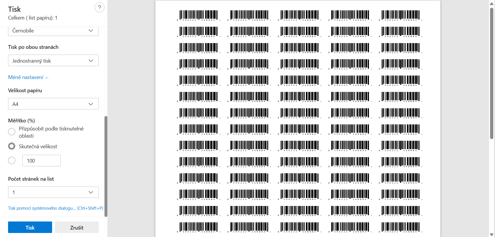

# Popis tisku

## Typy eanu

### EAN 13

- má dvě možnosti tisku 35 x 10 a 35.6 x 16.9 (zatím nepoužíváme) rozdíl je jasně visuálně viditelný
- 35 x 10 má v levém horním rohu značku žlutý ┌
- 35.6 x  16.9 nemá v žádném rohu žádnou značku

### EAN 8

- tiskne se vždy na 21 x 8
- má v levém horním rohu žlutý ┌

## Tisk

Pokud dojde nějaký z EANů tisk dalšího je následující:

1) najít složku EANů / barcodu
    - C:\barcode\PDFBarcode
    

1) vyberu který mě chybí, jednotlivé EANy jsou pojmenovány dle svého číslo
    

1) identifikuju papír
    - EAN8
        - 21 x 8
    - EAN13
        - 35 x 10

1) vložím správný papír do tiskárny
    - pokud má žlutý roh, tak žlutý roh musí být vlevo v zadu
    - vždy se ujistit že papír je správně vložený

1) PDF tisk
    - otevřu soubor v Edge prohlížeči na PDF (pokud nikdo nezměnil měl by to být defaultní prohlížeč v PC)
    

    - otevřu další nastavení
    

    - v rámci tisku nastavím **Skutečná velikost**. Nebude probíhat žádné zmenšování nebo zvětšování
    

    - vytisknu

